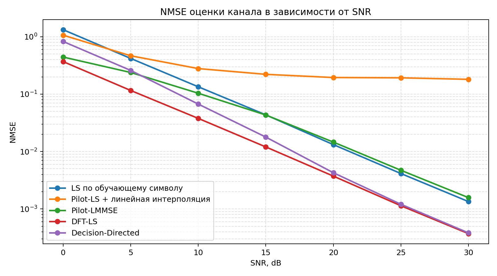
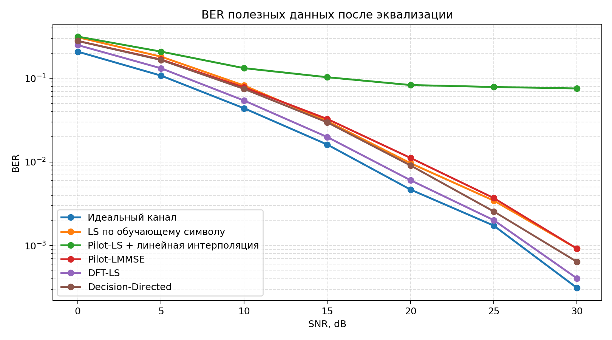
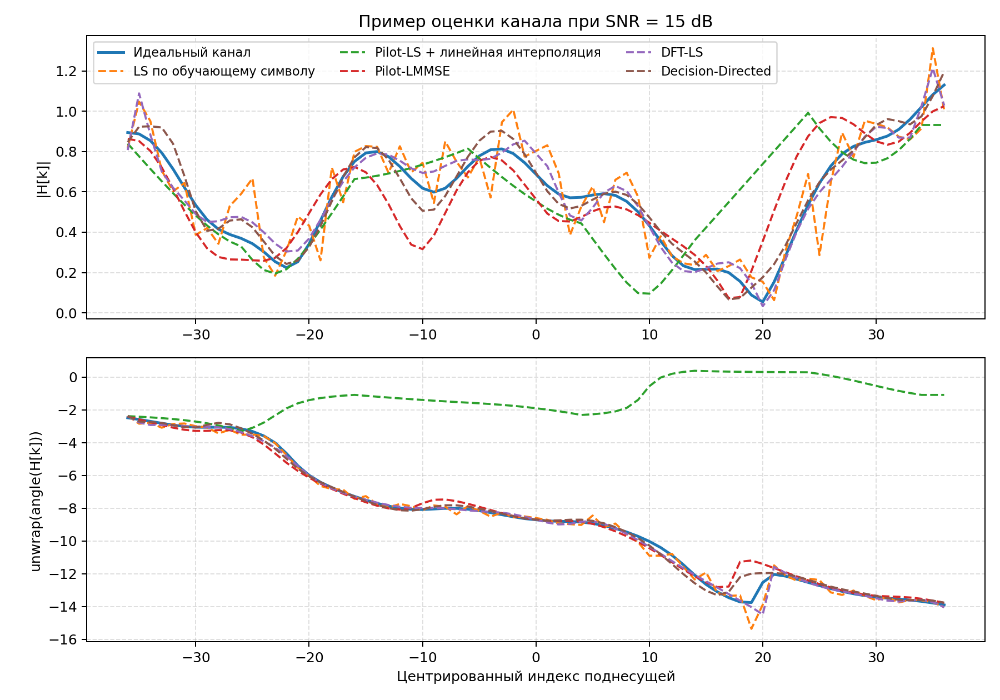

# Отчёт по оценке канала в OFDM

## Цель

В этом отчёте сравниваются практические методы оценки канала для OFDM-кадра, который уже используется в проекте:

- размер БПФ: `128`
- длина циклического префикса: `20`
- пилотные поднесущие: `[28, 38, 48, 58, 68, 78, 88, 98]`
- число информационных поднесущих: `64`
- число активных поднесущих: `72`
- модуляция полезных данных: нормированная `QPSK`
- модель канала: рэлеевский многолучевой канал с задержками `[0, 1, 3, 5, 8, 12]` и нормированными мощностями `[0.3592, 0.2543, 0.18, 0.1136, 0.0569, 0.0359]`
- число испытаний Монте-Карло на каждое значение `SNR`: `500`

Используется модель приёма

`Y[k] = H[k] * X[k] + W[k]`

где качество оценки измеряется по двум метрикам:

- `NMSE = E[|H_hat - H|^2] / E[|H|^2]`
- `BER` полезных данных после одноканальной эквализации.

## Реализованные методы оценки

### 1. LS по обучающему символу

Классическая оценка метода наименьших квадратов по полностью известному обучающему OFDM-символу:

`H_hat[k] = Y_train[k] / X_train[k]`

Это естественная базовая оценка для текущего приёмника, потому что в кадре уже есть отдельный обучающий символ перед полезными данными.

### 2. Pilot-LS + линейная интерполяция

Сначала выполняется LS-оценка только в пилотных позициях:

`H_ls[p] = Y_p[p] / X_p[p]`

затем полученная оценка линейно интерполируется по частоте на все активные поднесущие.

### 3. Pilot-LMMSE

Пилотная линейная оценка минимальной среднеквадратической ошибки:

`H_hat = R_hp (R_pp + sigma^2 I)^(-1) H_ls,p`

Здесь используются корреляционные матрицы канала, построенные по той же модели многолучевого канала, что и в эксперименте.

### 4. DFT-LS

Это стандартный вариант временной оценки канала, известный как `DFT-LS`:

1. сначала вычисляется LS-оценка на активных поднесущих,
2. затем оценка проектируется на импульсную характеристику канала, длина которой не превышает `CP`,
3. после этого короткая импульсная характеристика снова переводится в частотную область.

Такой подход подавляет шум вне допустимой области задержек и соответствует временной области представления из теории.

### 5. Decision-Directed

Полуслепая `decision-directed` оценка:

1. начальная оценка строится методом `Pilot-LMMSE`,
2. полезные данные эквализуются,
3. по ним принимаются жёсткие решения,
4. затем по восстановленным символам строится уточнённая оценка канала,
5. итоговая оценка сглаживается тем же методом `DFT-LS`.

Это не полностью слепая оценка, а именно полуслепой подход с опорой на пилоты и принятые решения.

## NMSE оценки канала

| Метод | 10 dB | 20 dB | 30 dB |
|---|---:|---:|---:|
| LS по обучающему символу | 1.3422e-01 | 1.3196e-02 | 1.3414e-03 |
| Pilot-LS + линейная интерполяция | 2.7860e-01 | 1.9454e-01 | 1.8101e-01 |
| Pilot-LMMSE | 1.0364e-01 | 1.4592e-02 | 1.5724e-03 |
| DFT-LS | 3.7780e-02 | 3.7271e-03 | 3.7070e-04 |
| Decision-Directed | 6.7077e-02 | 4.2653e-03 | 3.8206e-04 |

## BER после эквализации

| Метод | 10 dB | 20 dB | 30 dB |
|---|---:|---:|---:|
| Идеальный канал | 4.3781e-02 | 4.6719e-03 | 3.1250e-04 |
| LS по обучающему символу | 8.1906e-02 | 9.6562e-03 | 9.2187e-04 |
| Pilot-LS + линейная интерполяция | 1.3216e-01 | 8.3047e-02 | 7.5594e-02 |
| Pilot-LMMSE | 7.7859e-02 | 1.1172e-02 | 9.2187e-04 |
| DFT-LS | 5.4187e-02 | 6.0469e-03 | 4.0625e-04 |
| Decision-Directed | 7.4688e-02 | 9.0781e-03 | 6.4063e-04 |

## Пример одной реализации канала

Ниже показан пример истинной и оценённых характеристик канала для одной случайной реализации при `SNR = 15 dB`.

## Основные выводы

1. `Pilot-LS + линейная интерполяция` показывает худший результат в частотно-селективном канале, потому что восемь пилотов должны восстановить всю активную полосу, а шум LS-оценки напрямую переносится в интерполяцию.
2. `Pilot-LMMSE` заметно лучше обычного пилотного LS-метода, особенно при низком и среднем `SNR`, так как использует априорную корреляцию канала.
3. `LS по обучающему символу` уже даёт хороший базовый результат, потому что оценка строится сразу по всем активным поднесущим.
4. `DFT-LS` оказался лучшим практическим методом в этом эксперименте: ограничение длины импульсной характеристики эффективно подавляет шум вне области допустимых задержек.
5. `Decision-Directed` улучшает оценку по сравнению с чисто пилотными методами при среднем и высоком `SNR`, но на низком `SNR` может деградировать из-за ошибочных решений по полезным данным.

## Что имеет смысл перенести в основной приёмник

1. Сохранить текущий обучающий OFDM-символ, потому что он уже даёт сильную опорную оценку канала.
2. В качестве первого практического улучшения заменить текущую частотную LS-оценку на `DFT-LS`.
3. Оставить пилоты в полезной части кадра для последующей компенсации остаточной фазовой ошибки и `decision-directed` уточнения.
4. На следующем этапе сравнить те же методы уже в более нестационарном канале, где характеристики меняются быстрее во времени.

## Воспроизводимость

Этот отчёт и все графики автоматически генерируются скриптом:

`results/generate_channel_estimation_report.py`
